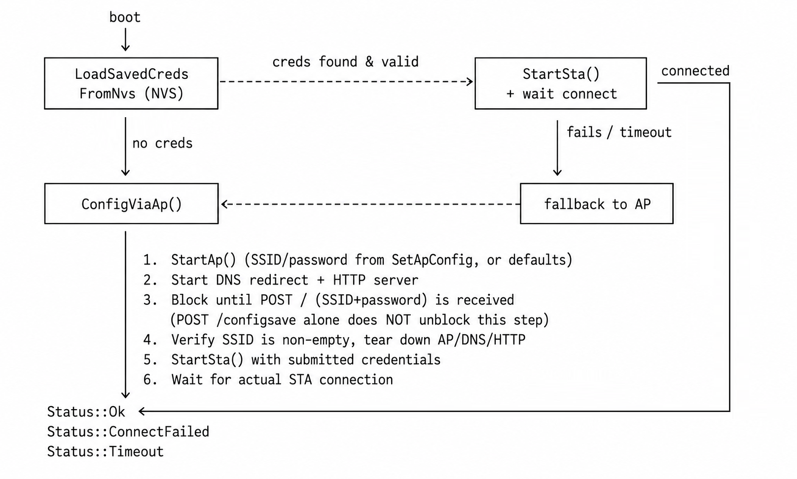

# WiFiPan

Captive-portal WiFi provisioning component for ESP32 / ESP-IDF, written in C++. Handles AP-mode config portal, DNS redirect for captive-portal detection (iOS / Android / Windows), NVS-persisted STA credentials with auto-reconnect, a dynamic form-field schema for app-specific config, and an OTA firmware
upload endpoint.

## Features

- **Auto-provisioning**: on boot, tries saved STA credentials from NVS; if none exist or the connection fails, falls back to AP config mode.
- **Captive portal**: built-in DNS server redirects all queries to the device, plus detection endpoints for Apple / Android / Windows so the OS auto-opens the config page.
- **Dynamic fields**: register extra config fields (`Page::AddParam`) that render on `/config` alongside WiFi setup - no HTML editing required.
- **OTA over HTTP**: `/ota` accepts a `multipart/form-data` firmware upload and flashes it via `esp_ota_*`.
- **No dynamic allocation for form state**: fixed-size `std::array` storage, bounded by `kMaxParams` / `kFieldLen`.

## Project layout

```text
WiFiPan/
├── CMakeLists.txt
├── README.md           # API reference and repo description
├── WiFiPan.hpp         # public API (Manager, Page)
├── WiFiPan.cpp         # WiFi lifecycle (Init/StartSta/StartAp/ConfigViaAp/AutoConnect)
├── WiFiPan_Internal.h  # Manager::Impl - event group, netif, httpd handle (internal only)
├── WiFiPan_Page.cpp    # dynamic form-field schema (Page class)
├── WiFiPan_Portal.cpp  # HTTP handlers, DNS server, OTA upload
└── WiFiPan_Html.h      # embedded HTML/JS for the portal pages
```

## Quick start

```cpp
#include "WiFiPan.hpp"

WiFiPan::Manager wifi;

extern "C" void app_main(void)
{
    wifi.Init();

    // Recommended: change these before flashing to production devices.
    wifi_ap_config_t ap_cfg{};
    std::strncpy(reinterpret_cast<char *>(ap_cfg.ssid), "MyDevice-Setup", sizeof(ap_cfg.ssid) - 1);
    std::strncpy(reinterpret_cast<char *>(ap_cfg.password), "a-strong-password", sizeof(ap_cfg.password) - 1);
    ap_cfg.authmode = WIFI_AUTH_WPA_WPA2_PSK;
    wifi.SetApConfig(ap_cfg);

    // Recommended: protects /ota and /reset while the portal is up.
    wifi.SetAdminToken("some-random-per-device-secret");

    // Optional: extra fields shown on /config, e.g. an MQTT broker address.
    wifi.page().AddParam("mqtt_host", "MQTT Broker", "e.g. broker.local", "", "text", false);

    WiFiPan::Status st = wifi.AutoConnect(); // blocks until connected or the portal is closed
    if (st != WiFiPan::Status::Ok) {
        ESP_LOGE("app", "WiFi provisioning failed: %d", static_cast<int>(st));
    }

    const char *mqtt_host = wifi.page().GetParam("mqtt_host");
    // ...
}
```

## Provisioning flow



**Note:** submitting the `/config` page (dynamic extra fields via
`/configsave`) saves those values but does **not** by itself complete
provisioning - only a valid SSID submitted via `/` does. This avoids
reporting success when the device never actually joined a network.

## HTTP endpoints

| Method | Path         | Purpose                                       | Auth  |
|--------|--------------|-----------------------------------------------|-------|
| GET    | `/`          | Portal home / WiFi scan+select page           | none  |
| POST   | `/`          | Submit SSID + password                        | none  |
| GET    | `/scan`      | WiFi scan results (blocking scan)             | none  |
| GET    | `/config`    | Dynamic extra-fields form (if any registered) | none  |
| POST   | `/configsave`| Save extra field values                       | none  |
| GET    | `/reset`     | Reboot the device                             | token*|
| GET    | `/ota`       | OTA upload page                               | token*|
| POST   | `/ota`       | Upload + flash firmware (multipart/form-data) | token*|

\* Auth is enforced only if `Manager::SetAdminToken()` was called with a non-empty value. **If you don't set a token, these two endpoints are open to anyone who can reach the portal** - acceptable only for a closed setup AP that's torn down immediately after provisioning; do not rely on this default if you ever start the web server while the device is on your production STA network. Send the token either as header `X-Admin-Token: <token>` or query string `?token=<token>`.

## Security notes

- **Default AP credentials** (`kApSsidDefault` / `kApPasswordDefault`) are public, well-known values baked into this open-source component - **always override them** with `SetApConfig()` before shipping a device. AP passwords under 8 characters are rejected (`Status::WeakApPassword`); leave the password field empty for an intentionally open setup AP.
- The captive-portal web server (and therefore `/ota`, `/reset`) is only started during `ConfigViaAp()` and torn down once provisioning finishes - it is not exposed while the device is running normally on your STA network, unless your application code calls `StartWebServer()` itself.
- Form input (SSID, extra params) is HTML/JS-escaped before being embedded in portal pages (`Page::BuildFieldsHtml`, `Page::BuildConfigInject`).

## Status codes

```cpp
enum class Status
{
    Ok              = 0,
    InvalidArg      = -1,
    InitFailed      = -2,
    WifiError       = -3,
    Timeout         = -4, /* AP failed to start, or no credentials submitted in time */
    NoCreds         = -5,
    NetifError      = -6,
    NoMem           = -7,
    ConnectFailed   = -8, /* credentials submitted, but STA never actually connected */
    WeakApPassword  = -9, /* AP password 1-7 chars (WPA2 requires >= 8, or empty for open) */
};
```

## License

MIT